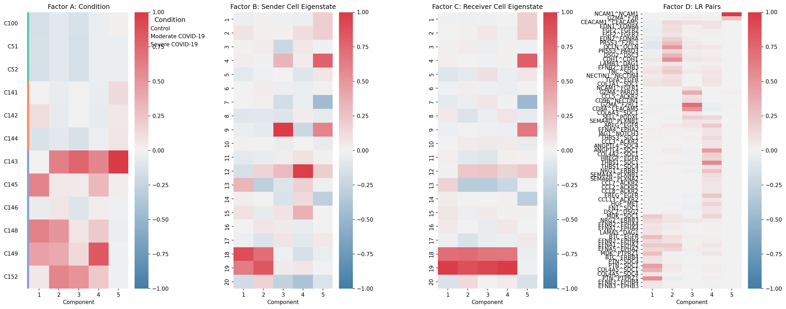
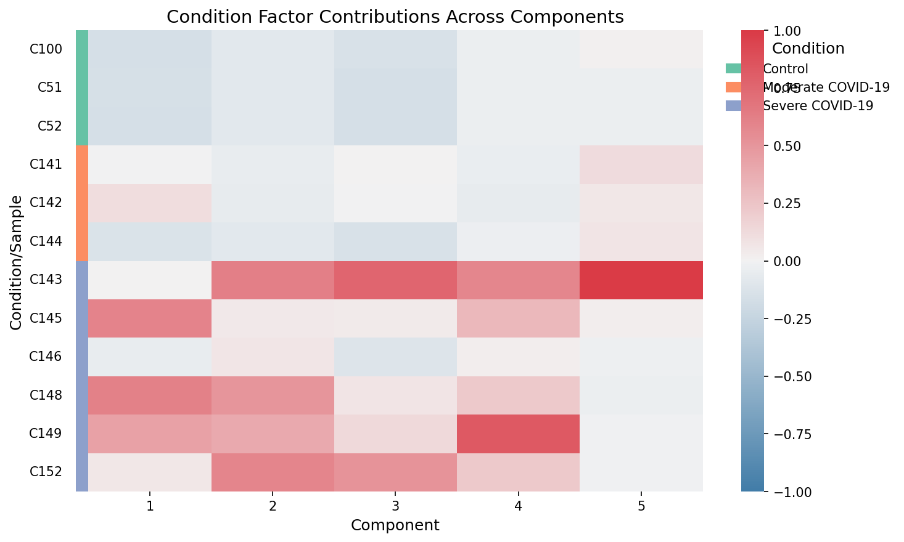
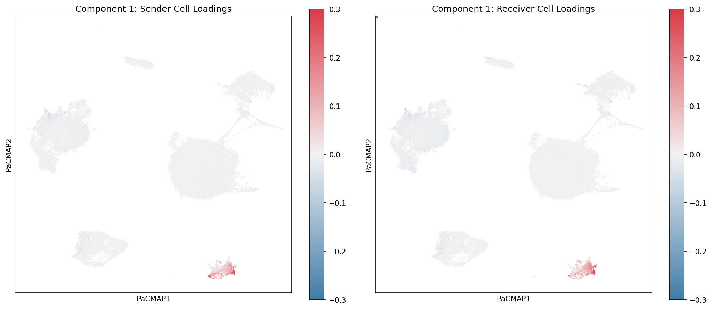
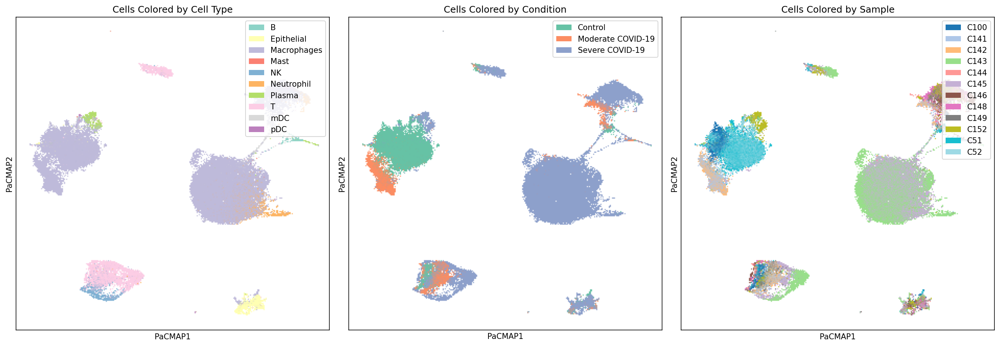
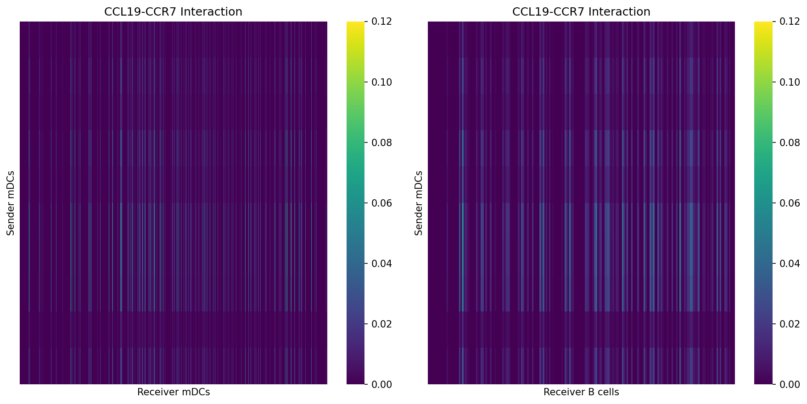

Tutorial for CCC-RISE: Cell-Cell Communication Analysis
========================================================

This tutorial demonstrates the complete CCC-RISE workflow for analyzing cell-cell communication in single-cell RNA-seq data across experimental conditions.

Installation
------------

To add CCC-RISE to your Python package, add the following line to your ``requirements.txt`` and remake your virtual environment::

    git+https://github.com/meyer-lab/cellcommunication-Pf2.git@main

Preprocessing the Dataset
--------------------------

**Input Requirements**

Your AnnData object must meet the following requirements:

1. **Condition Index**: Include an observations column ``condition_unique_idxs`` that is a 0-indexed array indicating which condition each cell is derived from, along with the cell barcode. Condition 1 cells are indexed as 0, Condition 2 as 1, and so on.

2. **Preprocessing**: Your AnnData object must be preprocessed (doublets removed, genes filtered, normalized, and log-transformed) before running CCC-RISE. Standard preprocessing functions can assist with gene filtering, normalization, and assigning ``condition_unique_idxs``.

3. **Ligand-Receptor Pairs**: CCC-RISE requires a DataFrame of ligand-receptor pairs to analyze cell-cell communication. This can be obtained from resources like LIANA, CellPhoneDB, or other ligand-receptor databases.

   **Required DataFrame Format**:
   
   - Must contain columns named ``ligand`` and ``receptor``
   - Gene names should match those in your AnnData object (typically uppercase)
   - For protein complexes, subunits should be separated by ``&`` (e.g., ``CD74&CD44``)
   - Example structure::
   
       ligand     receptor
       CCL19      CCR7
       PTN        PTPRZ1
       CD74&CD44  CD44
   
   The package includes a default function ``import_ligand_receptor_pairs()`` that loads a curated database, but you can provide your own DataFrame following this format.
   
  

**Using prepare_dataset**

The ``prepare_dataset`` function assists with preprocessing your data. Parameters:

- ``X``: AnnData object containing raw count data in sparse matrix format
- ``condition_name``: Name of the column in ``X.obs`` that specifies experimental conditions for each cell
- ``geneThreshold``: Minimum mean expression threshold for gene filtering (genes with mean expression below this value are removed)
- ``deviance``: If True, applies deviance transformation instead of log normalization (default: False)

The function performs the following steps:

- Filters cells with fewer than 10 total counts
- Filters genes based on the ``geneThreshold`` parameter
- Normalizes total counts per cell to the median
- Scales gene expression values
- Applies log₁₀((1000 × normalized_value) + 1) transformation (or deviance transformation if specified)
- Creates ``condition_unique_idxs`` column in ``X.obs`` with 0-indexed condition assignments
- Pre-calculates gene means and stores in ``X.var["means"]``

**Import and Prepare the Dataset**

Import your dataset as an AnnData object with preprocessed data::

    from cellcommunicationpf2.import_data import prepare_dataset, import_ligand_receptor_pairs
    import anndata
    
    # Load your data
    X = anndata.read_h5ad("your_data.h5ad")
    
    # Prepare the dataset
    X = prepare_dataset(X, condition_name="condition", geneThreshold=0.01)
    
    # Load ligand-receptor pairs
    lr_pairs = import_ligand_receptor_pairs()

Choosing the Rank
------------------

CCC-RISE involves two sequential factorization steps, each requiring rank selection:

1. **RISE Rank Selection**: Determines how many components to extract from the raw scRNA-seq data
2. **CPD Rank Selection**: Determines how many components to use when factorizing the interaction tensor

Both steps require careful evaluation using two complementary metrics:

- **R²X (Variance Explained)**: Measures the proportion of variance in the data explained by the model. Higher values indicate better model fit, but values plateau as rank increases, suggesting diminishing returns.
- **FMS (Factor Match Score)**: Measures the stability/reproducibility of components across different random initializations or bootstrap samples. Values above ~0.6 indicate stable, reliable components. Low FMS suggests overfitting or noise.

RISE Rank Selection
^^^^^^^^^^^^^^^^^^^

**What is RISE?**

RISE uses PARAFAC2 decomposition to identify latent communication modes directly from the scRNA-seq expression matrix. The RISE rank determines how many latent patterns are extracted before computing cell-cell communication scores.

**Evaluate RISE Ranks**

Test different RISE ranks to find the optimal balance between model complexity and stability::

    from cellcommunicationpf2.figures.commonFuncs.plotGeneral import plot_fms_r2x_diff_ranks
    import matplotlib.pyplot as plt
    
    # Create figure with two subplots
    fig, ax = plt.subplots(1, 2, figsize=(12, 4))
    
    rise_ranks = list(range(5, 31, 5))
    
    # Plot FMS and R2X for different RISE ranks
    plot_fms_r2x_diff_ranks(
        X, 
        condition_column="condition_unique_idxs",
        ax1=ax[0], 
        ax2=ax[1], 
        ranksList=rise_ranks, 
        runs=3
    )
    
    ax[0].set_title('RISE: Factor Match Score (FMS)')
    ax[0].set_xlabel('RISE Rank')
    ax[1].set_title('RISE: Variance Explained (R²X)')
    ax[1].set_xlabel('RISE Rank')
    plt.tight_layout()
    plt.show()

.. image:: _static/tutorial_images/step1_rise_fms_r2x.png
   :width: 700px
   :align: center

**Interpretation**:

- **R²X**: Look for where the curve begins to plateau. Beyond this point, additional components explain minimal additional variance.
- **FMS**: Choose a rank where FMS is above 0.6, indicating stable components. Higher FMS means the factors are more reproducible.
- **Recommendation**: Balance both metrics. Typically, select the rank where FMS exceeds 0.6 and R²X shows diminishing returns (e.g., RISE rank = 20-40 for most datasets).

CPD Rank Selection
^^^^^^^^^^^^^^^^^^

**What is CPD?**

After RISE, an interaction tensor is computed from cell-cell communication scores between all cell pairs across L-R pairs and conditions. CPD (Canonical Polyadic Decomposition) factorizes this tensor to identify interpretable communication patterns. The CPD rank determines how many communication components are extracted.

**Evaluate CPD Ranks**

First, calculate the interaction tensor using a selected RISE rank, then test different CPD ranks::

    from cellcommunicationpf2.tensor import calculate_interaction_tensor, run_fms_r2x_analysis
    import seaborn as sns
    import matplotlib.pyplot as plt
    
    # Calculate interaction tensor with chosen RISE rank
    rise_rank = 35  # Based on RISE analysis above
    interaction_tensor = calculate_interaction_tensor(X, lr_pairs, rise_rank=rise_rank)
    
    # Test CPD ranks
    cpd_ranks = list(range(1, 21, 2))
    cpd_results = run_fms_r2x_analysis(
        interaction_tensor, 
        rank_list=cpd_ranks, 
        runs=3,
        svd_init="random"
    )
    
    # Plot CPD FMS and R2X
    fig, ax = plt.subplots(1, 2, figsize=(12, 4))
    
    sns.lineplot(data=cpd_results, x='Component', y='FMS', ax=ax[0], marker='o')
    ax[0].set_xlabel('CPD Rank')
    ax[0].set_ylabel('Factor Match Score (FMS)')
    ax[0].set_title(f'CPD: Factor Stability (RISE rank={rise_rank})')
    ax[0].axhline(y=0.6, color='r', linestyle='--', label='Stability Threshold')
    ax[0].set_ylim(0, 1)
    ax[0].legend()
    
    sns.lineplot(data=cpd_results, x='Component', y='R2X', ax=ax[1], marker='o', color='orange')
    ax[1].set_xlabel('CPD Rank')
    ax[1].set_ylabel('R²X (Variance Explained)')
    ax[1].set_title(f'CPD: Variance Explained (RISE rank={rise_rank})')
    
    plt.tight_layout()
    plt.show()

.. image:: _static/tutorial_images/step2_cpd_fms_r2x.png
   :width: 700px
   :align: center

**Interpretation**:

- **R²X**: Monitor how much of the interaction tensor's variance is explained. Look for an elbow point where additional components provide minimal improvement.
- **FMS**: Ensure components are stable (FMS > 0.6). Lower FMS indicates components may vary significantly with different initializations.
- **Recommendation**: Select the CPD rank where both FMS is high (>0.6) and R²X shows an elbow. Typically 5-15 components capture most meaningful communication patterns.

**Summary: Two-Step Rank Selection**

1. **First**: Select RISE rank based on expression data (typically 20-40)
2. **Second**: Select CPD rank based on interaction tensor (typically 5-15)
3. **Use both R²X and FMS** at each step to balance model fit with component stability

Running the Factorization
--------------------------

**Perform CCC-RISE Factorization**

Based on the rank selection analysis above, choose appropriate RISE and CPD ranks and run the complete CCC-RISE workflow. This performs the two-step factorization: first extracting latent communication modes from expression data (RISE), then factorizing the resulting interaction tensor (CPD)::

    from cellcommunicationpf2.tensor import run_ccc_rise_workflow
    
    # Select ranks based on FMS/R2X analysis
    rise_rank = 35  # Selected from RISE rank analysis
    cp_rank = 8     # Selected from CPD rank analysis
    
    # Run the complete workflow
    X, r2x = run_ccc_rise_workflow(
        adata=X,
        rise_rank=rise_rank,
        cp_rank=cp_rank,
        lr_pairs=lr_pairs,
        condition_column="condition_unique_idxs",
        n_iter_max=10000,
        tol=1e-9,
        random_state=42,
        complex_sep="&",
        doEmbedding=True
    )
    
    print(f"Variance Explained (R²X): {r2x:.4f}")

**Function Parameters**

The ``run_ccc_rise_workflow`` function executes the complete CCC-RISE pipeline:

- ``adata``: AnnData object with preprocessed scRNA-seq data
- ``rise_rank``: Number of PARAFAC2 components to extract from expression data
- ``cp_rank``: Number of CPD components for factorizing the interaction tensor (if None, defaults to ``rise_rank``)
- ``lr_pairs``: DataFrame of ligand-receptor pairs with 'ligand' and 'receptor' columns
- ``condition_column``: Column name in ``adata.obs`` containing condition identifiers (default: "sample")
- ``n_iter_max``: Maximum iterations for decomposition (default: 100)
- ``tol``: Convergence tolerance (default: 1e-3)
- ``random_state``: Random seed for reproducibility (default: None)
- ``complex_sep``: Separator for protein complexes in L-R pairs (default: None)
- ``doEmbedding``: If True, computes PaCMAP embeddings for visualization (default: True)
- ``svd_init``: Initialization method for CPD ('svd' or 'random', default: 'svd')

**What Gets Stored**

The function returns the AnnData object with added results and the final R²X value. The following are stored in the AnnData object:

**Factor Matrices** (in ``X.uns``):

- ``X.uns["weights"]`` - Component weights (array of length ``cp_rank``)
- ``X.uns["A"]`` - Condition factor matrix (n_conditions × ``cp_rank``)
- ``X.uns["B"]`` - Sender cell type factor matrix (``rise_rank`` × ``cp_rank``)
- ``X.uns["C"]`` - Receiver cell type factor matrix (``rise_rank`` × ``cp_rank``)
- ``X.uns["D"]`` - Ligand-receptor pair factor matrix (n_lr_pairs × ``cp_rank``)

**Cell Projections** (in ``X.obsm``):

- ``X.obsm["projections"]`` - Cell projections from PARAFAC2 (n_cells × ``rise_rank``)
- ``X.obsm["sc_B"]`` - Sender cell loadings (n_cells × ``cp_rank``)
- ``X.obsm["rc_C"]`` - Receiver cell loadings (n_cells × ``cp_rank``)
- ``X.obsm["PaCMAP"]`` - PaCMAP embedding for visualization (n_cells × 2, if ``doEmbedding=True``)

**Additional Information**:

- ``X.uns["lr_pairs"]`` - Array of ligand-receptor pair names used in the analysis
- ``X.uns["r2x"]`` - Variance explained by the CPD factorization

Visualizing the Factors
------------------------

CCC-RISE decomposes cell-cell communication into four factor matrices, each revealing different aspects of the communication patterns. The package provides specialized plotting functions to visualize each factor type.

**Overview of the Four Factors**

The factorization produces four interpretable factor matrices:

1. **Factor A (Condition Factor)**: Shows how each experimental condition (e.g., patient sample, time point) contributes to each component
2. **Factor B (Sender Cell Eigenstate)**: Represents sender cell patterns in the latent RISE space
3. **Factor C (Receiver Cell Eigenstate)**: Represents receiver cell patterns in the latent RISE space
4. **Factor D (Ligand-Receptor Pairs)**: Shows which L-R pairs drive each communication component

**Visualize All Four Factors**

Create a comprehensive visualization showing all four factor types::

    from cellcommunicationpf2.figures.commonFuncs.plotFactors import (
        plot_condition_factors,
        plot_eigenstate_factors,
        plot_lr_factors
    )
    import matplotlib.pyplot as plt
    
    # Create figure with 4 subplots
    fig, ax = plt.subplots(1, 4, figsize=(20, 8))
    
    # Prepare condition grouping (if you have multiple conditions per group)
    condition_column = "sample"  # or your condition column name
    group_col = "condition"      # optional: higher-level grouping
    
    # Create mapping from samples to their condition groups
    sample_to_group = X.obs.drop_duplicates(
        subset=[condition_column, group_col]
    ).set_index(condition_column)[group_col]
    
    # Factor A: Condition factors
    plot_condition_factors(
        X,
        ax[0],
        cond=condition_column,
        cond_group_labels=sample_to_group,
        group_cond=True,   # Sort by condition groups
        normalize=True     # Normalize each component
    )
    ax[0].set_title("Factor A: Condition")
    
    # Factor B: Sender cell eigenstates
    plot_eigenstate_factors(X, ax[1], factor_type="B")
    ax[1].set_title("Factor B: Sender Cell Eigenstate")
    
    # Factor C: Receiver cell eigenstates
    plot_eigenstate_factors(X, ax[2], factor_type="C")
    ax[2].set_title("Factor C: Receiver Cell Eigenstate")
    
    # Factor D: Ligand-receptor pairs
    plot_lr_factors(
        X, 
        ax[3], 
        trim=True,      # Show only top L-R pairs
        weight=0.06     # Threshold for inclusion
    )
    ax[3].set_title("Factor D: LR Pairs")
    
    plt.tight_layout()
    plt.show()

**Understanding Each Factor**

- **Factor A (Condition)**: Heatmap rows represent conditions/samples, columns represent components. High values indicate which conditions are enriched in each communication pattern.

- **Factor B (Sender Eigenstate)**: Heatmap shows sender cell patterns in the latent space. Each row is a latent dimension from RISE, each column is a CPD component.

- **Factor C (Receiver Eigenstate)**: Similar to Factor B but for receiver cells. Reveals which latent receiver cell states participate in each component.

- **Factor D (LR Pairs)**: Shows which ligand-receptor interactions drive each component. Only top-weighted pairs are displayed for clarity.

**Visualize Individual Condition Factors**

For a detailed view of condition factors across components::

    fig, ax = plt.subplots(figsize=(10, 6))
    
    plot_condition_factors(
        X,
        ax,
        cond=condition_column,
        cond_group_labels=sample_to_group,
        group_cond=True,
        normalize=True
    )
    ax.set_xlabel("Component", fontsize=12)
    ax.set_ylabel("Condition/Sample", fontsize=12)
    ax.set_title("Condition Factor Contributions Across Components", fontsize=14)
    plt.tight_layout()
    plt.show()

**Visualize Cell Projections with PaCMAP**

Explore how individual cells are positioned in the latent communication space::

    import matplotlib.pyplot as plt
    import seaborn as sns
    
    # Plot PaCMAP embedding colored by cell type
    fig, axes = plt.subplots(1, 2, figsize=(14, 6))
    
    # Color by cell type
    scatter1 = axes[0].scatter(
        X.obsm["PaCMAP"][:, 0],
        X.obsm["PaCMAP"][:, 1],
        c=X.obs["cell_type"].cat.codes,
        cmap="tab20",
        s=1,
        alpha=0.5
    )
    axes[0].set_title("PaCMAP: Colored by Cell Type")
    axes[0].set_xlabel("PaCMAP 1")
    axes[0].set_ylabel("PaCMAP 2")
    
    # Color by condition
    scatter2 = axes[1].scatter(
        X.obsm["PaCMAP"][:, 0],
        X.obsm["PaCMAP"][:, 1],
        c=X.obs["condition"].cat.codes,
        cmap="Set1",
        s=1,
        alpha=0.5
    )
    axes[1].set_title("PaCMAP: Colored by Condition")
    axes[1].set_xlabel("PaCMAP 1")
    axes[1].set_ylabel("PaCMAP 2")
    
    plt.tight_layout()
    plt.show()

.. image:: _static/tutorial_images/step5_pacmap_embedding.png
   :width: 700px
   :align: center

**Visualize Specific Component Loadings**

Examine which cells have high loadings in a specific component::

    # Select a component to visualize
    component = 0  # 0-indexed
    
    fig, axes = plt.subplots(1, 2, figsize=(14, 6))
    
    # Sender cell loadings for this component
    scatter1 = axes[0].scatter(
        X.obsm["PaCMAP"][:, 0],
        X.obsm["PaCMAP"][:, 1],
        c=X.obsm["sc_B"][:, component],
        cmap="viridis",
        s=2,
        alpha=0.6
    )
    axes[0].set_title(f"Component {component}: Sender Cell Loadings")
    plt.colorbar(scatter1, ax=axes[0], label="Loading")
    
    # Receiver cell loadings for this component
    scatter2 = axes[1].scatter(
        X.obsm["PaCMAP"][:, 0],
        X.obsm["PaCMAP"][:, 1],
        c=X.obsm["rc_C"][:, component],
        cmap="plasma",
        s=2,
        alpha=0.6
    )
    axes[1].set_title(f"Component {component}: Receiver Cell Loadings")
    plt.colorbar(scatter2, ax=axes[1], label="Loading")
    
    plt.tight_layout()
    plt.show()

Advanced Component Visualizations
----------------------------------

**PaCMAP Plots with Built-in Functions**

Use specialized plotting functions to visualize component weightings across all components::

    from cellcommunicationpf2.figures.commonFuncs.plotPaCMAP import (
        plot_wc_pacmap,
        plot_labels_pacmap
    )
    import matplotlib.pyplot as plt
    
    # Get the number of components
    cp_rank = X.uns["A"].shape[1]
    
    # Create grid for all components
    fig, axes = plt.subplots(2, cp_rank, figsize=(4*cp_rank, 8))
    
    # Plot sender cell weightings for each component
    for i in range(cp_rank):
        plot_wc_pacmap(
            X, 
            i + 1,  # Component number (1-indexed)
            axes[0, i], 
            factor_matrix="B",  # Sender cells
            cbarMax=0.3
        )
        axes[0, i].set_title(f"Component {i+1}: Sender Cells")
    
    # Plot receiver cell weightings for each component
    for i in range(cp_rank):
        plot_wc_pacmap(
            X, 
            i + 1,  # Component number (1-indexed)
            axes[1, i], 
            factor_matrix="C",  # Receiver cells
            cbarMax=0.3
        )
        axes[1, i].set_title(f"Component {i+1}: Receiver Cells")
    
    plt.tight_layout()
    plt.show()

.. image:: _static/tutorial_images/step7_all_component_weightings.png
   :width: 800px
   :align: center

**Visualize Cell Type and Condition Labels**

Create clean PaCMAP visualizations with categorical labels::

    import seaborn as sns
    
    fig, axes = plt.subplots(1, 3, figsize=(18, 6))
    
    # Plot colored by cell type
    pal = sns.color_palette(palette="Set3")
    pal = pal.as_hex()
    plot_labels_pacmap(X, labelType="celltype", ax=axes[0], color_key=pal)
    axes[0].set_title("Cells Colored by Cell Type")
    
    # Plot colored by condition
    pal = sns.color_palette("Set2")
    pal = [pal[0], pal[1], pal[2]]
    pal = [f"#{int(r*255):02x}{int(g*255):02x}{int(b*255):02x}" for r, g, b in pal]
    plot_labels_pacmap(X, labelType="condition", ax=axes[1], color_key=pal)
    axes[1].set_title("Cells Colored by Condition")
    
    # Plot colored by sample
    plot_labels_pacmap(X, labelType="sample", ax=axes[2])
    axes[2].set_title("Cells Colored by Sample")
    
    plt.tight_layout()
    plt.show()

**Violin Plots of Component Weights by Cell Type**

Examine the distribution of component weights for specific cell types::

    import seaborn as sns
    import pandas as pd
    
    # Select a component and cell type of interest
    component = 5  # 0-indexed
    cell_type = "mDC"
    
    # Filter cells by cell type
    X_celltype = X[X.obs["celltype"] == cell_type]
    
    # Extract sender cell weights for this component
    sender_weights = X_celltype.obsm["sc_B"][:, component]
    
    # Create violin plot
    fig, ax = plt.subplots(figsize=(6, 6))
    sns.violinplot(data=sender_weights, ax=ax)
    ax.set_ylim(-0.1, max(sender_weights) + 0.1)
    ax.set_xlabel(f"{cell_type} Weight Distribution")
    ax.set_ylabel(f"Sender Cell Component {component+1} Association")
    ax.set_title(f"Distribution of Component {component+1} Weights in {cell_type}")
    plt.tight_layout()
    plt.show()

.. image:: _static/tutorial_images/step9_violin_weights.png
   :width: 500px
   :align: center

This visualization reveals whether a component is broadly active across all cells of a type or concentrated in a subset.

Interpreting a Component
-------------------------

Once you've identified components of interest, dig deeper into the specific cell types and ligand-receptor pairs driving the communication patterns.

**Expression Product Heatmaps**

Visualize the ligand-receptor expression products between sender and receiver cell populations to validate predicted interactions::

    from cellcommunicationpf2.utils import (
        expression_product_matrix,
        average_product_matrix_ccc
    )
    import numpy as np
    
    # Select a component and L-R pair of interest
    component = 5  # 0-indexed
    ligand = "CCL19"
    receptor = "CCR7"
    
    # Filter and sort sender cells by component weight
    sender_celltype = "mDC"
    X_sender = X[X.obs["celltype"] == sender_celltype]
    X_sender = X_sender[np.argsort(-X_sender.obsm["sc_B"][:, component])]
    
    # Filter and sort receiver cells by component weight
    receiver_celltype = "mDC"
    X_receiver = X[X.obs["celltype"] == receiver_celltype]
    X_receiver = X_receiver[np.argsort(-X_receiver.obsm["rc_C"][:, component])]
    
    # Calculate expression product matrix
    df = expression_product_matrix(X_sender, X_receiver, ligand, receptor)
    df = average_product_matrix_ccc(df)
    
    # Create heatmap
    fig, ax = plt.subplots(figsize=(8, 8))
    sns.heatmap(df, ax=ax, cmap="viridis", vmax=0.12)
    ax.set_xlabel(f"Receiver {receiver_celltype}s")
    ax.set_ylabel(f"Sender {sender_celltype}s")
    ax.set_title(f"{ligand}-{receptor} Interaction in Component {component+1}")
    ax.set_xticks([])
    ax.set_yticks([])
    plt.tight_layout()
    plt.show()

.. image:: _static/tutorial_images/step10_expression_product.png
   :width: 600px
   :align: center

This heatmap shows the product of ligand expression (in senders) and receptor expression (in receivers), revealing which cell pairs have the highest potential for this specific interaction.

**Compare Communication Across Cell Types**

Investigate how the same L-R pair functions between different cell type combinations::

    fig, axes = plt.subplots(1, 2, figsize=(14, 6))
    
    # Same sender, different receiver (e.g., mDC to mDC)
    X_sender = X[X.obs["celltype"] == "mDC"]
    X_sender = X_sender[np.argsort(-X_sender.obsm["sc_B"][:, component])]
    
    X_receiver_mdc = X[X.obs["celltype"] == "mDC"]
    X_receiver_mdc = X_receiver_mdc[np.argsort(-X_receiver_mdc.obsm["rc_C"][:, component])]
    
    X_receiver_b = X[X.obs["celltype"] == "B"]
    X_receiver_b = X_receiver_b[np.argsort(-X_receiver_b.obsm["rc_C"][:, component])]
    
    # mDC -> mDC communication
    df1 = expression_product_matrix(X_sender, X_receiver_mdc, ligand, receptor)
    df1 = average_product_matrix_ccc(df1)
    sns.heatmap(df1, ax=axes[0], cmap="viridis", vmax=0.12)
    axes[0].set_xlabel("Receiver mDCs")
    axes[0].set_ylabel("Sender mDCs")
    axes[0].set_title(f"{ligand}-{receptor}: mDC→mDC")
    axes[0].set_xticks([])
    axes[0].set_yticks([])
    
    # mDC -> B cell communication
    df2 = expression_product_matrix(X_sender, X_receiver_b, ligand, receptor)
    df2 = average_product_matrix_ccc(df2)
    sns.heatmap(df2, ax=axes[1], cmap="viridis", vmax=0.12)
    axes[1].set_xlabel("Receiver B cells")
    axes[1].set_ylabel("Sender mDCs")
    axes[1].set_title(f"{ligand}-{receptor}: mDC→B")
    axes[1].set_xticks([])
    axes[1].set_yticks([])
    
    plt.tight_layout()
    plt.show()

**Summary of Component Interpretation**

For each component of interest:

1. **Examine Factor A**: Which conditions/samples show high activity?
2. **Check Factors B and C**: Which latent cell states (eigenstates) are involved as senders and receivers?
3. **Inspect Factor D**: Which L-R pairs have high weights?
4. **Validate with expression products**: Confirm that top-weighted L-R pairs show coordinated expression in the predicted sender-receiver cell populations
5. **Compare across cell types**: Understand whether communication is cell type-specific or broadly active

.. image:: _static/tutorial_images/step6_communication_heatmap.png
   :width: 600px
   :align: center

**Communication Heatmap**: This visualization shows the communication scores between sender cells (rows) and receiver cells (columns) for a specific ligand-receptor pair.

**Analyze Top LR Pairs per Component**

Identify the most important ligand-receptor pairs for a specific component::

    cmp = 5
    lr_factor = X.uns["D"][:, cmp-1]
    lr_names = X.uns["lr_pair_names"]
    
    # Get top 10 LR pairs
    top_indices = np.argsort(np.abs(lr_factor))[-10:][::-1]
    
    print(f"\nTop 10 LR pairs for Component {cmp}:")
    for i, idx in enumerate(top_indices, 1):
        print(f"{i}. {lr_names[idx]}: {lr_factor[idx]:.4f}")

.. image:: _static/tutorial_images/step7_top_lr_pairs.png
   :width: 600px
   :align: center
